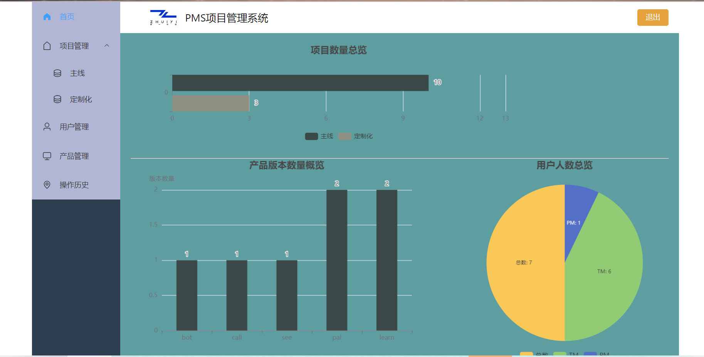
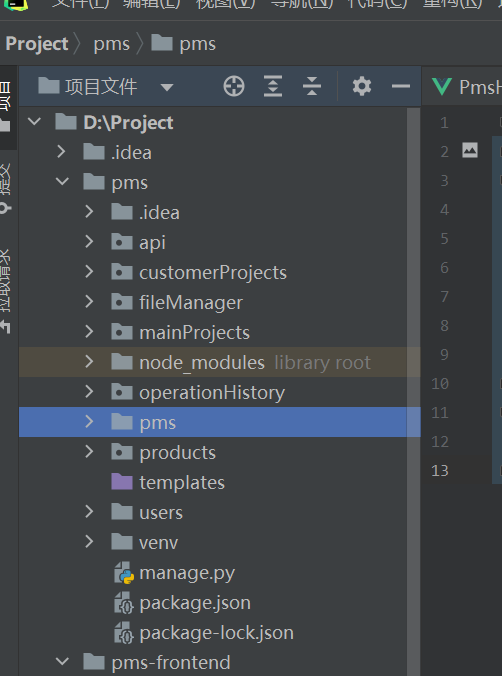
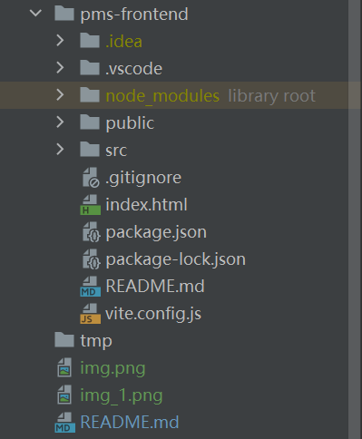
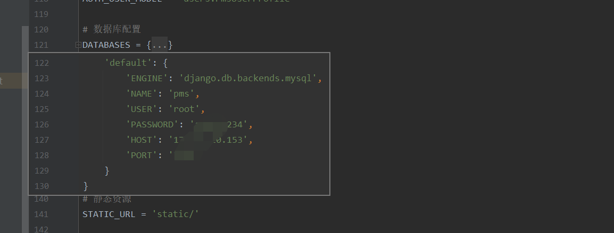
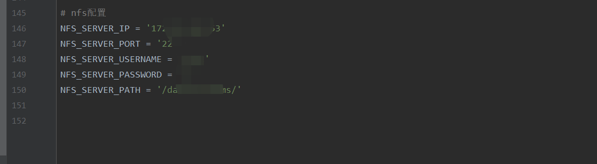
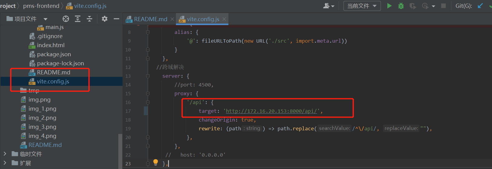

# 功能说明

# 代码说明
· 前端 vue   

npm: 9.5.1

node: 18.16.1

nginx : 1.23.2

· 后端 python3.11 + pip23.2.1 

· 数据库 mysql8

· 存储 NFS
# 目录说明


pms： 项目主目录

api： 接口入口目录

customerProjects: 定制化项目接口

fileManager: 文件相关接口

mainProjects: 主线项目接口

operationHistory：操作日志接口

products：产品接口

users： 用户接口

# 安装
- 数据库安装
```shell
# ll
-rw-r--r-- 1 root    root  222 Jul  3 09:56 docker-compose.yaml
drwxr-xr-x 8 polkitd root 4096 Jul  3 10:29 mysql_data
#
cat docker-compose.yaml
version: '3'
services:
  mysql:
    image: mysql:8
    restart: always
    environment:
      MYSQL_ROOT_PASSWORD: admin1234
    ports:
      - 3307:3306 #宿主机:容器
    volumes:
      - ./mysql_data:/var/lib/mysql
```
- nfs安装(略)
```shell
# cat /etc/exports
/data/nfs/pms *(rw,sync,no_root_squash)
```
- 代码拉取
```shell
# git init
# git remote add origin https://github.com/yinfuqian/pms.git
# git pull origin mastger
```
- 修改后端配置
```shell
vim  pms/settings.py
```



```shell
修改前端配置（api配置）
```

- 打包前端
```shell
npm install  
npm run build
```
- 部署后端应用,迁移数据库
```shell
cd pms/pms
python3 install -r requirement.txt
python3 manage.py makemigrations
python3 manage.py migrate
python3 manage.py runserve server 0.0.0.0:8000
```
- 部署前端应用
```yaml
version: '3'
services:
  nginx:
    image: docker.io/nginx:1.23.2
    ports:
      - 8080:80
    volumes:
      - ./nginx.conf:/etc/nginx/conf/nginx.conf
      - ./conf.d:/etc/nginx/conf.d/
      - ./dist:/dist/
      - /etc/hosts:/etc/hosts
      - ./log:/var/log/nginx/

    command: ["nginx", "-g", "daemon off;"]
```
```shell
[root@nginx-pms]# ls -la
drwxr-xr-x  2 root root    4096 Sep 18 10:30 conf.d
drwxrwxrwx  3 root root    4096 Sep 14 19:07 dist
-rw-r--r--  1 root root     317 Sep 18 09:57 docker-compose.yaml
drwxr-xr-x  2 root root    4096 Sep 14 17:59 log
-rw-r--r--  1 root root     760 Sep 14 17:59 nginx.conf
[root@nginx-pms]#
[root@nginx-pms]# cat conf.d/pms.conf
server {
    listen 80;
    server_name _;

    root /dist;
    index index.html;

    location /api {
        if ($request_method !~ ^(GET|POST|PUT)$ ) {
            return 405;
        }
        proxy_pass http://172.16.20.153:8000;
        #proxy_method POST PUT GET;
    }

    location / {
	if ($request_method !~ ^(GET|POST|PUT)$ ) {
            return 405;
        }
        try_files $uri $uri/ /index.html;
    }
}

[root@ nginx-pms]# cat nginx.conf
user root;
worker_processes  auto;

#error_log  logs/error.log;
#pid        logs/nginx.pid;


events {
    worker_connections  65535;
}


http {
    client_max_body_size 100M;
    include       mime.types;
    default_type  application/octet-stream;

    log_format custom_format '$remote_addr - $remote_user [$time_local] '
                             '"$request" $status $body_bytes_sent '
                             '"$http_referer" "$http_user_agent"'
			     '$request_time';

    access_log /var/log/nginx/access.log custom_format;
    error_log  /var/log/nginx/error.log debug;

    types_hash_max_size 2048;
    sendfile on;
    tcp_nopush on;
    tcp_nodelay on;
    sendfile        on;
    keepalive_timeout  65;
    include ../conf.d/*.conf;


}
[root@nginx-pms]#
[root@nginx-pms]# docker-compose up -d
```
```shell
http://xxx.xxx.xxx.xxx:8080
```
- 新建默认用户
```shell
python3 manage.py createsuperuser
```
